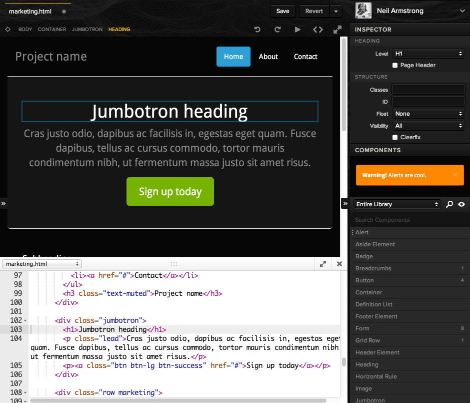

# Web Components in Action
### Fluent 2014

Created by **Michael Bleigh ([@mbleigh](http://twitter.com/mbleigh))** of **[Divshot](http://www.divshot.com/)**

===

# A Roadmap

1. What are web components?
2. Why are they important?
3. How do I use web components to **actually build things**?

===

# Before we Begin...

---

# Chrome Dev Channel

---

# Get Experimental
## Enable these Chrome Features

1. Enable experimental Web Platform features.
2. Enable HTML Imports.

---

# Clone Me

`git clone https://github.com/mbleigh/web-components-in-action.git`

===

# Origins of Web Components

---

## In The Beginning...


---

## But Today...



---

# Web Sites != Web Apps

---

# Frameworks are Great! But...

---

# Is This What We Want?

```html
<div class="dropdown">
  <button class="btn dropdown-toggle sr-only" type="button" id="dropdownMenu1" data-toggle="dropdown">
    Dropdown
    <span class="caret"></span>
  </button>
  <ul class="dropdown-menu" role="menu" aria-labelledby="dropdownMenu1">
    <li role="presentation"><a role="menuitem" tabindex="-1" href="#">Action</a></li>
    <li role="presentation"><a role="menuitem" tabindex="-1" href="#">Another action</a></li>
    <li role="presentation"><a role="menuitem" tabindex="-1" href="#">Something else here</a></li>
    <li role="presentation" class="divider"></li>
    <li role="presentation"><a role="menuitem" tabindex="-1" href="#">Separated link</a></li>
  </ul>
</div>
```

---

# Wouldn't It Be Nice...

```html
<dropdown-menu label="Dropdown">
  <dropdown-item href="#">Action</dropdown-item>
  <dropdown-item href="#">Another Action</dropdown-item>
  <dropdown-divider></dropdown-divider>
  <dropdown-item href="#">Separated Link</dropdown-item>
</dropdown-menu>
```

---

# Web Components Are

* Encapsulated
* Reusable
* **Browser-Native** (soon)
* Not just for UI

---

# Web Components Are

* HTML Imports
* Templates
* Shadow DOM
* Custom Elements

===

# HTML Imports

```html
<link rel="import" href="antiquities.html">
```

---

## What HTML Imports Do

* Fetch imported documents (recursively) 
* Make imported DOM available on the `<link>` element
* Add to page styles and scripts
* **Define custom elements**

---

## HTML Imports Do Not Work Like This

```html
<!doctype html>
<html>
  <body>
    <link rel="import" href="header.html">
    <!-- Page Content Here -->
    <link rel="import" href="footer.html">
  </body>
</html>
```

---

# HTML Imports Work Like This

```html
<link rel="import" href="other-page.html" id="other-page">
<script>
  var otherDoc = document.getElementById('other-page').import;
  otherDoc.querySelector('#neato');
</script>
```

---

# For Now:
## HTML Imports = Custom Element Loaders

===

# The Template Tag
## Inert DOM has never been so fun.

---

# Dead Simple

```html
<template id="my-template">
  <script>alert("Don't run me!");</script>
  <header>This is some content.</header>
  <section>But it's inert.</section>
</template>
```

```js
var template = document.querySelector('#my-template');
document.body.appendChild(
  document.importNode(template.content, true); // second argument is 'deep'
);
```

---

# How is it Different?

1. **Inert.** Images aren't loaded, scripts aren't run.
2. **Invisible.** Does not render, will not until activated.
3. **Goes Anywhere.** Can be inlined at *any* point in the HTML.

===

# The Shadow DOM
## Coolest Sounding Standard. Ever.

---

# We Know to Separate Content and Presentation

---

# But what if CSS isn't enough?

---

# JS Makes DOMs Dirty

---

# Shadow DOM Cleans it Up

---

# For Example, Syntax Highlighting Looks Nice...

```js
// so highlight
var doge = function(word) {
  return "such " + word + ". much wow";
}
```

---

# ...On the Outside

```html
<code class="lang-js actionscript"><span class="comment">// so highlight</span>
<span class="keyword">var</span> doge = <span class="function"><span class="keyword">function</span><span class="params">(word)</span> {</span>
  <span class="keyword">return</span> <span class="string">"such "</span> + word + <span class="string">". much wow"</span>;
}
</code>
```

---

# Let's fix it!

[Clean Syntax Highlighting with Shadow DOM](../examples/shadow-dom/clean-highlight.html)

---

# But Wait! There's More

---

# Style Encapsulation

```html
<template>
  <style>
    /* these styles are scoped to the shadow root */
    :host { /* applies to the hosting element */ }
    #shadow-only { color: black; }
  </style>
  
  <p id="shadow-only">This is only in the Shadow</p>
</template>
```

---

# Exercise One
## Shadow DOM Dismissable

`exercises/01-shadow-dismissable`

---

# Neato!
## But something feels a bit off...

---

# What happens if...

1. The DOM changes and we have new dismissables added?
2. We need configuration options that don't easily map to a class name?
3. We don't want to pollute our CSS class space with behaviors?

===

# Custom Elements
## The Raison d'être